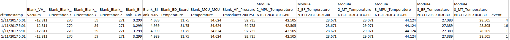
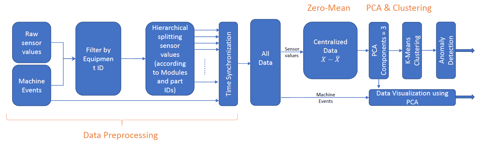
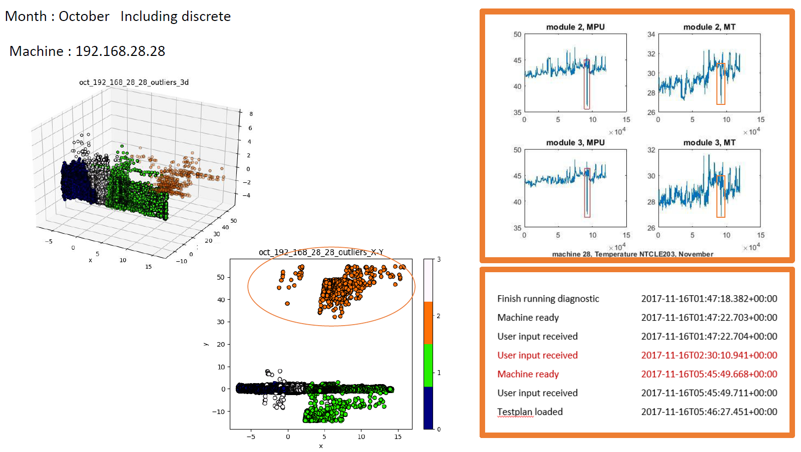
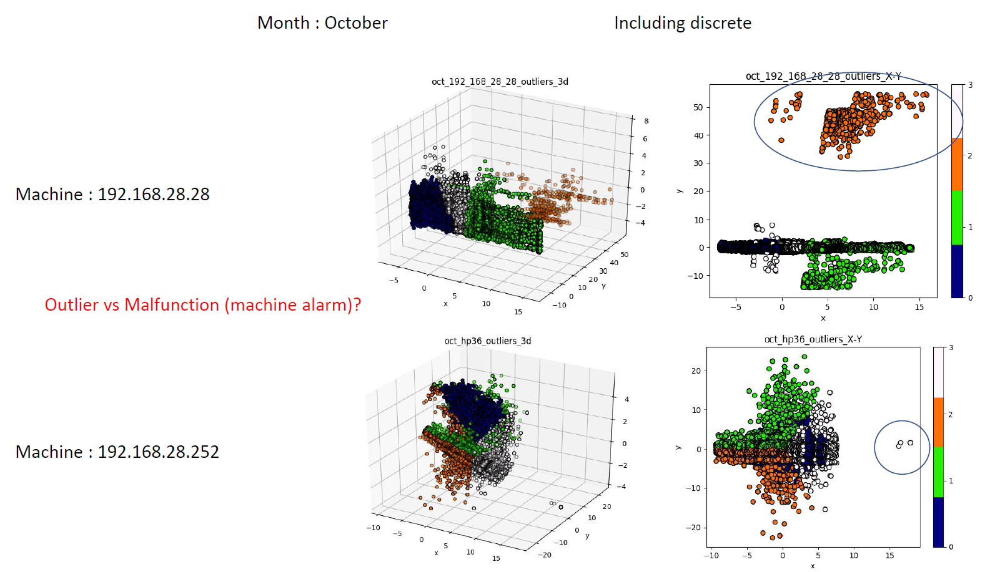

# Predictive-Maintance-Model
## Completed work:
A requirement to implement a degradation model for an industrial machine and predict the failures beforehand. Currently, PCA and clustering based anomaly detection method for time series has been implemented. 

# Dependencies

numpy

scikit-learn > 0.19.1

pandas > 0.20.3

# Dataset

Data streams from an active two industrial machines in a customer site. Due to the big dataset, it has been embedded in to pickle files to increase the computational efficiency. 

## Dataset structure

# Completed work Summery

## Architecture

## Results of anomaly detection

## Current work

Implementing a time series prediction and tracking of outliers using LSTM and CNN, (on-going project).
